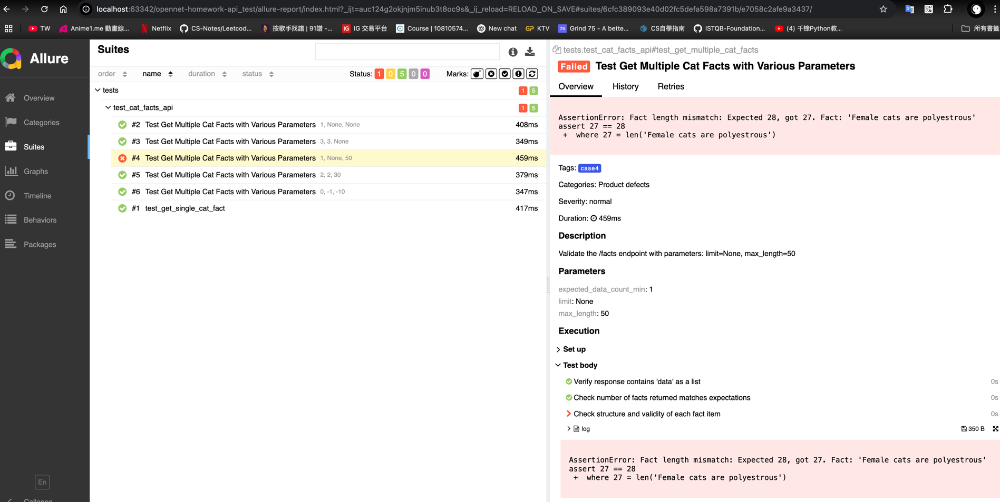

## Target API

All tests in this project target the Cat Facts API, with its base URL being: `https://catfact.ninja`.

## Test Cases

The following five core test cases are implemented, covering the main functionalities of the Cat Facts API, and are expected to pass successfully:

| Test Case ID           | Scenario                               | Request Method & Endpoint  | Parameters (if any)                | Expected Result                                                          | Validation Method                                                       |
|:-----------------------| :------------------------------------- | :----------------------- | :--------------------------------- | :----------------------------------------------------------------------- | :---------------------------------------------------------------------- |
| TC_CF_001              | **[Main Flow]** Get a Single Random Cat Fact | `GET /fact`              | None                               | 1. HTTP Status Code 200 (OK) <br> 2. Response is a JSON object <br> 3. Contains `fact` (string) and `length` (integer) fields | 1. Check status code <br> 2. Check response JSON structure and data types <br> 3. Validate `fact` length matches `length` value (after stripping whitespace) |
| TC_CF_002              | **[Main Flow]** Get Multiple Cat Facts (Default Quantity) | `GET /facts`             | None                               | 1. HTTP Status Code 200 (OK) <br> 2. Response is a JSON object <br> 3. Contains `data` (array) field, with each element containing `fact` and `length` | 1. Check status code <br> 2. Check response JSON structure <br> 3. Validate `data` array element structure |
| TC_CF_003              | **[Main Flow]** Get a Specific Number of Cat Facts | `GET /facts`             | `limit=3`                          | 1. HTTP Status Code 200 (OK) <br> 2. Response is a JSON object <br> 3. `data` array length equals `limit` | 1. Check status code <br> 2. Validate `data` array length matches `limit` |
| TC_CF_004 *(has bug)*  | **[Main Flow]** Get Cat Facts with Specific Max Length | `GET /facts`             | `max_length=50`                    | 1. HTTP Status Code 200 (OK) <br> 2. Response is a JSON object <br> 3. Each `fact` in `data` array has length <= `max_length` | 1. Check status code <br> 2. Validate length of each `fact`             |
| TC_CF_005              | **[Main Flow]** Get Multiple Cat Facts (Combined Parameters) | `GET /facts`             | `limit=2&max_length=30`            | 1. HTTP Status Code 200 (OK) <br> 2. Response is a JSON object <br> 3. `data` array length equals `limit` <br> 4. Each `fact` length <= `max_length` | 1. Check status code <br> 2. Validate `data` array length and length of each `fact` |
| TC_CF_006 *(negative)* | **[Negative Case]** Invalid Parameters        | `GET /facts`      | `limit=-1&max_length=-10`          | - Should return error or empty result <br> - No valid facts returned                                              | - Assert absence of valid `data` or empty list <br> - Ensure graceful error or 4xx status             |



## Validation Methods Used

The primary validation methods employed in these tests focus on the HTTP response from the API:

* **HTTP Status Code Validation:** Verifies that the server responds with the correct HTTP status code (e.g., `200 OK` for success). This confirms the fundamental outcome of the request.
* **JSON Schema and Data Type Validation:** When the API returns data in JSON format, validating the structure of the JSON payload is crucial. This includes:
    * **Presence of Expected Keys:** Ensuring all required fields are present (e.g., `fact`, `length`, `data`).
    * **Correct Data Types:** Verifying that values for specific keys are of the expected type (e.g., `fact` is a string, `length` is an integer, `data` is an array).
    * **Data Structure:** Confirming that the response is an object or an array, and its internal structure conforms to expectations.
* **Data Content Validation:** For the specific parameters of the Cat Facts API, additional content validations are performed:
    * **Length Consistency:** Validating that the actual length of the returned `fact` string (after stripping leading/trailing whitespace) exactly matches the value in the `length` field. This addresses potential discrepancies caused by the API returning facts with unnecessary whitespace characters.
    * **Maximum Length Constraint:** When the `max_length` parameter is used, validating that the length of all returned `fact` contents does not exceed the specified value.
    * **Quantity Accuracy:** When the `limit` parameter is used, validating that the number of facts in the returned `data` array exactly matches the `limit` value.

These validations collectively ensure that the API operates as expected under normal circumstances, providing reliable and parameter-compliant responses.

## Environment Setup and Running Tests

### Prerequisites

* Python 3.x
* `pip3` (Python package installer)

### Setup Steps

1.  **Clone the repository:**
    ```bash
    git clone https://github.com/zxc5131210/opennet-homework-api_test.git
    ```
2.  **Create and activate a virtual environment (recommended):**
    A virtual environment helps isolate project dependencies, preventing conflicts with system-wide or other project dependencies.
    ```bash
    python -m venv venv
    ```
    *Activate on macOS/Linux:*
    ```bash
    source venv/bin/activate
    ```
3.  **Install project dependencies:**
    ```bash
    pip install -r requirements.txt
    ```

### Running Tests


Before running the script, give it execute permission:
```bash
chmod +x run_tests.sh
````
### Run All Tests and Generate Report
```bash
./run_tests.sh
```